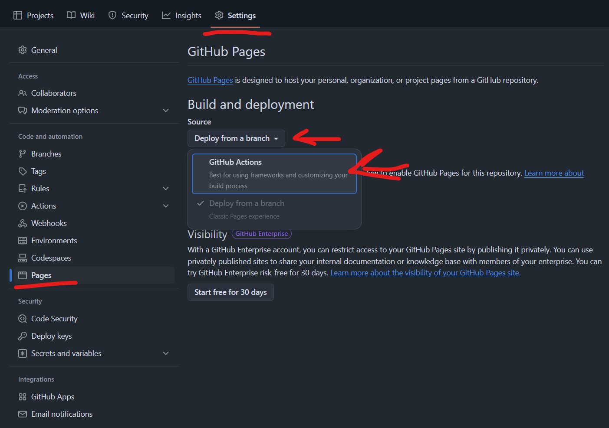

# Настройка GitHub Actions и Pages

## Включение GitHub Actions

1. Перейдите в настройки репозитория (вкладка Settings)
2. В боковом меню выберите "Pages"
3. В разделе "Build and deployment":
   - Выберите "Deploy from a branch"
   - В выпадающем списке выберите "GitHub Actions"

## Что делают GitHub Actions?

1. **check.yml**
   - Запускает все линтеры и проверки кода
   - Проверяет валидность HTML, CSS и JavaScript
   - Проверяет соответствие БЭМ-методологии

2. **gh-pages.yml**
   - Собирает проект
   - Публикует собранный проект на GitHub Pages
   - Создает публичную ссылку на ваш проект

## Запуск Actions

### Автоматический запуск
При каждом пуше в ветку `main`:
- Запустятся проверки кода
- Если проверки прошли успешно, сайт автоматически опубликуется
- Ссылку на опубликованный сайт можно найти во вкладке Settings > Pages

### Ручной запуск
1. Перейдите во вкладку "Actions"
2. Выберите нужный workflow (check или gh-pages)
3. Нажмите "Run workflow"
4. Выберите ветку для запуска
5. Нажмите зеленую кнопку "Run workflow"

Это может быть полезно, если вы хотите:
- Перезапустить проверки
- Обновить деплой без изменения кода
- Протестировать работу с другой ветки
